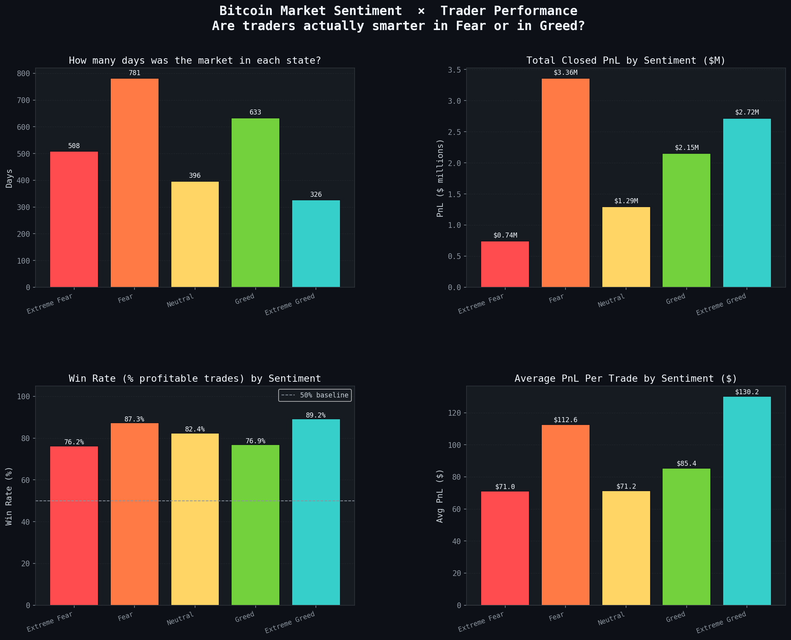
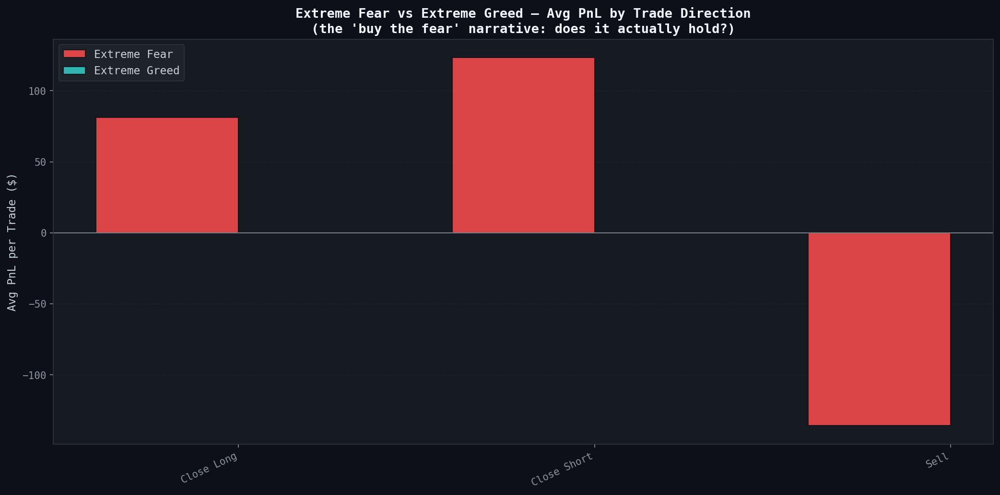

# 📈 Crypto Behavioral Intelligence

### Leveraging Market Psychology to Understand Trading Behavior in Crypto Markets


---

## Executive Summary

Financial markets are influenced not only by economic fundamentals but also by investor emotions. In cryptocurrency markets, where volatility and sentiment often drive decision-making, understanding behavioral patterns can provide a significant trading edge.

**Crypto Behavioral Intelligence** explores the relationship between Bitcoin market sentiment and trader performance by combining the Bitcoin Fear & Greed Index with historical trading data from Hyperliquid.

Through sentiment-aware analysis, this project uncovers how trader profitability, win rates, asset preferences, and risk-taking behavior evolve across different market conditions, helping identify actionable insights for traders, analysts, and quantitative researchers.

> **Can market sentiment help explain trading success, and can it be used as a signal for smarter trading decisions?**

---

## Repository Highlights

* End-to-end Data Analytics Workflow
* Sentiment-Based Trading Analysis
* Behavioral Finance Insights
* Modular Python Codebase
* Professional Data Visualizations
* Reproducible Research Structure
* Portfolio-Ready Documentation

---

## Business Objective

The primary objective of this project is to investigate how market sentiment impacts trading performance and to uncover insights that can support:

* Quantitative Trading Strategy Development
* Risk Management Optimization
* Market Timing Decisions
* Behavioral Finance Research
* Web3 Trading Intelligence Systems

---

## Dataset

Due to GitHub file size limitations, the complete historical trading dataset is not stored in this repository.

### Download Links

#### Historical Trader Data

https://drive.google.com/file/d/1IAfLZwu6rJzyWKgBToqwSmmVYU6VbjVs/view?usp=sharing

#### Bitcoin Fear & Greed Index

https://drive.google.com/file/d/1PgQC0tO8XN-wqkNyghWc_-mnrYv_nhSf/view?usp=sharing

### Dataset Placement

After downloading the datasets, place them inside:

```text
data/
├── historical_data.csv
└── fear_greed_index.csv
```

Additional dataset information can be found in:

```text
data/DATASET.md
```

---

## Dataset Overview

### 1. Bitcoin Fear & Greed Index

The Fear & Greed Index is a market sentiment indicator that measures investor emotions on a scale from 0 to 100.

| Feature        | Description                                       |
| -------------- | ------------------------------------------------- |
| Date           | Observation Date                                  |
| Value          | Fear & Greed Score                                |
| Classification | Extreme Fear, Fear, Neutral, Greed, Extreme Greed |

---

### 2. Hyperliquid Historical Trading Data

A comprehensive dataset containing real-world cryptocurrency trading activity.

| Feature         | Description             |
| --------------- | ----------------------- |
| Account         | Trader Identifier       |
| Symbol          | Asset Traded            |
| Execution Price | Trade Execution Price   |
| Size            | Position Size           |
| Side            | Buy / Sell              |
| Leverage        | Leverage Used           |
| Closed PnL      | Realized Profit & Loss  |
| Timestamp       | Trade Execution Time    |
| Event           | Trade Event Information |

---

## Analytical Workflow

### Data Preparation

* Timestamp Standardization
* Data Cleaning & Validation
* Missing Value Handling
* Profitability Feature Engineering
* Sentiment Classification Processing

### Data Integration

Trading records are mapped to corresponding daily sentiment values using timestamp alignment, allowing every trade to be analyzed within its market sentiment context.

### Exploratory Analysis

The project investigates:

* Profitability by Sentiment Regime
* Win Rate Analysis
* Buy vs Sell Performance
* Top Trader Characteristics
* Asset-Level Profitability
* Monthly Trading Trends
* Contrarian Trading Opportunities

---

## Key Analytical Questions

### Market Sentiment

* How frequently does each sentiment regime occur?
* Which market conditions generate the highest profitability?

### Trader Performance

* Are traders more profitable during Fear or Greed periods?
* Does sentiment affect trade win rates?

### Behavioral Analysis

* How do top-performing traders differ from losing traders?
* Do profitable traders behave differently during market extremes?

### Asset Performance

* Which assets generate the strongest returns?
* Does sentiment influence asset-specific profitability?

---

## Visualization Suite

| Figure   | Analysis                                          |
| -------- | ------------------------------------------------- |
| Figure 1 | Market Sentiment & Performance Overview Dashboard |
| Figure 2 | Buy vs Sell Performance Analysis                  |
| Figure 3 | Monthly Profitability Trend                       |
| Figure 4 | Top Trader Performance Deep Dive                  |
| Figure 5 | Trader Tier Sentiment Heatmap                     |
| Figure 6 | PnL Distribution Analysis                         |
| Figure 7 | Top Cryptocurrency Performance                    |
| Figure 8 | Contrarian Strategy Evaluation                    |

---

## Project Preview

### Overview Dashboard



### Contrarian Trading Analysis



---

## Major Insights

### 1. Market Euphoria Drives Consistent Wins

Greed and Extreme Greed periods generally exhibit stronger win rates, suggesting momentum-based strategies perform well during bullish conditions.

### 2. Fear Creates High-Reward Opportunities

Although participation may decrease during fearful markets, selective trades often generate higher average returns.

### 3. Sentiment Influences Trading Outcomes

Profitability and trade success rates vary significantly across sentiment regimes, indicating that market psychology has a measurable impact on trading performance.

### 4. Top Traders Demonstrate Better Timing

High-performing traders consistently outperform by selecting better opportunities rather than simply increasing trading frequency.

### 5. Asset Selection Remains Critical

While sentiment matters, asset-specific performance differences remain substantial and should be considered alongside sentiment analysis.

### 6. Bull Markets Amplify Returns

Periods of elevated optimism correspond with significant increases in aggregate profitability across traders.

---

## Generated Outputs

The project generates analytical reports and performance summaries:

```text
outputs/
├── summary_statistics.csv
├── sentiment_analysis_report.csv
└── trader_performance_report.csv
```

These outputs provide quantitative insights that complement the visual analysis.

---

## Technology Stack

| Category                | Tools                                        |
| ----------------------- | -------------------------------------------- |
| Programming             | Python                                       |
| Data Processing         | Pandas, NumPy                                |
| Visualization           | Matplotlib                                   |
| Development Environment | Jupyter Notebook                             |
| Domain                  | Cryptocurrency Analytics, Behavioral Finance |

---

## Project Architecture

```text
Crypto-Behavioral-Intelligence/
│
├── README.md
├── requirements.txt
├── LICENSE
├── .gitignore
│
├── data/
│   ├── fear_greed_index.csv
│   └── DATASET.md
│
├── figures/
│   ├── fig1_overview_dashboard.png
│   ├── fig2_buy_vs_sell.png
│   ├── fig3_monthly_trend.png
│   ├── fig4_top_traders.png
│   ├── fig5_tier_sentiment_heatmap.png
│   ├── fig6_pnl_distribution.png
│   ├── fig7_top_coins.png
│   └── fig8_contrarian_insight.png
│
├── notebooks/
│   └── analysis.ipynb
│
├── outputs/
│   ├── summary_statistics.csv
│   ├── sentiment_analysis_report.csv
│   └── trader_performance_report.csv
│
└── src/
    ├── config.py
    ├── data_loader.py
    ├── preprocessing.py
    ├── analysis.py
    ├── visualizations.py
    ├── insights.py
    └── main.py
```

---

## Getting Started

### Clone the Repository

```bash
git clone https://github.com/YOUR_USERNAME/Crypto-Behavioral-Intelligence.git
cd Crypto-Behavioral-Intelligence
```

### Install Dependencies

```bash
pip install -r requirements.txt
```

### Download Datasets

Refer to:

```text
data/DATASET.md
```

for dataset download instructions.

### Run the Project

```bash
python src/main.py
```

---

## Future Enhancements

* Predictive Machine Learning Models
* Sentiment-Based Trade Signal Generation
* Strategy Backtesting Framework
* Risk-Adjusted Performance Metrics
* Interactive Streamlit Dashboard
* Real-Time Sentiment Monitoring
* Portfolio Optimization Models

---

## Results & Impact

This project demonstrates that market sentiment is more than a psychological indicator—it can be quantified, analyzed, and leveraged to better understand trading behavior.

By integrating sentiment data with real trading activity, the project provides valuable insights into market dynamics and lays the foundation for sentiment-aware trading systems and quantitative research.


                                                  --------------------------
